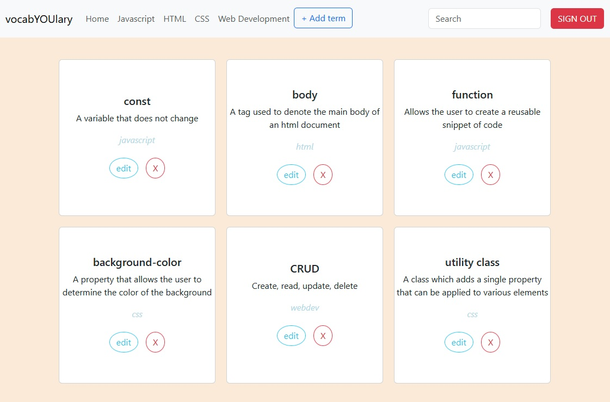

# Q2 - Individual Assessment: Vocab-YOU-lary 

This app allows users to create, view, edit, and delete vocabulary terms for four different topics related to web development.

[View App](https://vocabyoulary-terms.netlify.app/)

## About the User

- The ideal user is a teacher or student in a web development course
- They need a way to keep track of terms they want to remember or want their students to remember
- The problem this app solves is allowing users to keep track of flash cards for vocabulary to assist in memory

## Features

- Ability to add new terms and their respective definition and select a category that they will go into
- Each card is tagged by category
- Different users will see different lists of cards
- The user can filter output by category
- Terms that are incorrect can be edited
- Cards can be deleted as well

## Video Walkthrough of vocabYOUlary

  <iframe src="https://www.loom.com/embed/7b4978ec53444b8ea76cffffc25a4cbb?sid=5b315188-48fa-42fa-bfdd-d0933e9db4ef" frameborder="0" webkitallowfullscreen mozallowfullscreen allowfullscreen style="position: absolute; top: 0; left: 0; width: 100%; height: 100%;"></iframe>

## Relevant Links

[Project Board](https://github.com/users/mikemcgee92/projects/2/views/1)

[Flowchart](https://www.figma.com/board/B5l28AjUychoQHpw269zUR/vocabYOUlary-flowchart?node-id=0-1&t=WDWENPmDK53w17GM-1)

## Project Screenshots

## Contributors

[Mike McGee](https://github.com/mikemcgee92)
